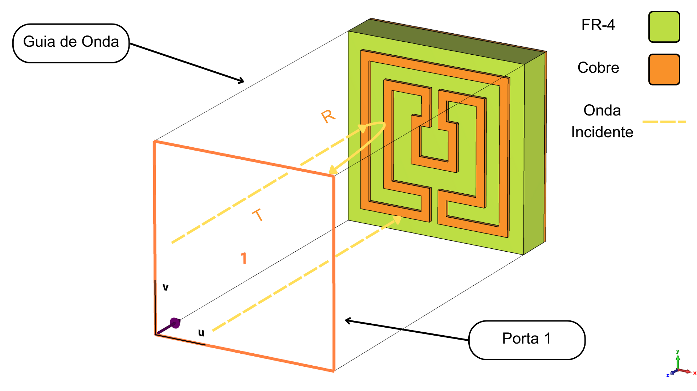

## 🎯 Absorvedor "Matryoska"

O nome do projeto deriva diretamente da geometria do dispositivo em estudo: um absorvedor seletivo em frequência com ressonadores anulares quadrados concêntricos, que lembram visualmente uma boneca **Matryoska**.

A estrutura é projetada para ser impressa sobre um substrato dielétrico com um plano de terra na camada inferior. Seu comportamento é caracterizado pelos parâmetros de espalhamento (S-parameters), S11 (reflexão) e S21 (transmissão).

A partir desses parâmetros, a **Absortividade (A)** da estrutura pode ser calculada. Considerando que o coeficiente de transmissão S21 é praticamente nulo (devido ao plano de terra), a absorção é dada pela fórmula:

$$ A(\omega) = 1 - |S_{11}(\omega)|^2 - |S_{21}(\omega)|^2 \approx 1 - |S_{11}(\omega)|^2 $$

Onde $|S_{11}|^2$ é a refletividade. O objetivo da otimização é, portanto, **maximizar o valor de $A$** nas frequências de interesse.

## 📈 Objetivo da Otimização

O objetivo central é otimizar as dimensões geométricas do FSA "Matryoska" para que ele atenda aos seguintes critérios de desempenho:

1.  **Operação Tri-Band:** Apresentar três picos de absorção distintos em três frequências de ressonância específicas: $f_1$, $f_2$ e $f_3$.
2.  **Alta Absorção:** Alcançar uma **Absortividade (A) superior a 95%** em cada uma dessas três frequências, garantindo uma eficiência muito alta na conversão de energia eletromagnética em calor.

A função de objetivo (*fitness function*), que os algoritmos buscarão maximizar, será diretamente o valor da absorção $A$, calculado a partir do parâmetro S11 fornecido pelas simulações eletromagnéticas.

## 🛠️ Algoritmos e Técnicas Implementadas

* **Particle Swarm Optimization (PSO):**
    * Implementação assistida por modelo substituto para otimização de objetivo único.
    * Exposição do otimizador PSO como um serviço através de uma **API RESTful**, permitindo que sistemas externos solicitem otimizações de forma remota.

* **NSGA-II (Non-dominated Sorting Genetic Algorithm II):**
    * Implementação assistida por modelo substituto para problemas de otimização **multiobjetivo**.

* **Cuckoo Search (CS):**
    * Implementação assistida por modelo substituto como alternativa ao PSO para otimização de objetivo único.

* **Modelos Substitutos (Surrogate Models):**
    * O framework é projetado para uso da machine learning chamada *Xgboost*, além de possuir o auxílio de técnicas para ajudar seus valores de regressão, como:
        * Features Engine.
        * Sharp Model.

## 📂 Estrutura do Repositório
